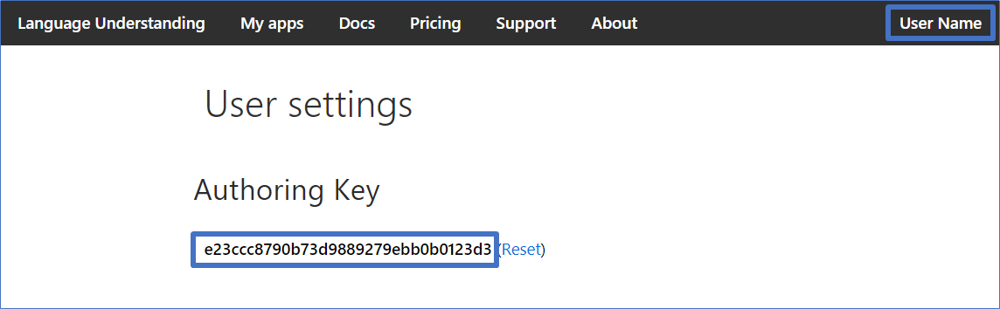
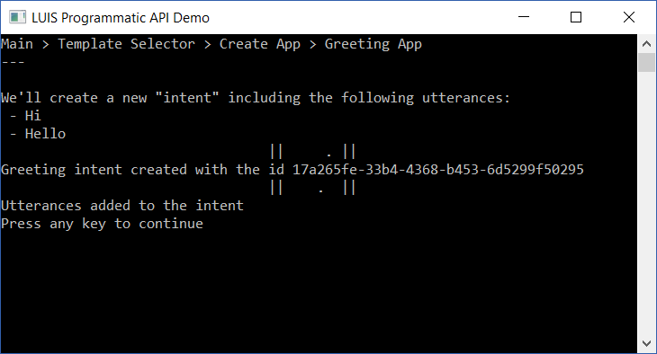
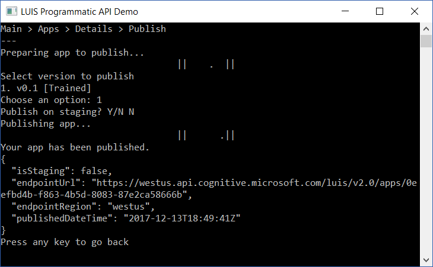

# Cognitive Services: LUIS Programmatic SDK Console Application Sample

A simple console that showcases how the SDK can be used to create and customize new LUIS apps.

### Prerequisites

The minimum prerequisites to run this sample are:
* The latest update of Visual Studio 2015 or 2017. You can download the community version [here](http://www.visualstudio.com) for free.
* A [LUIS.ai account](https://www.luis.ai/) where to upload the sample's LUIS model.

### How to run this sample

The first step to using this sample app is to get your Programmatic Key. Go to the home page, [www.luis.ai](https://www.luis.ai/), and log in. After creating your LUIS account, a starter key, also known as a programmatic key, is created automatically for LUIS account. To find the programmatic key, click on the account name in the upper-right navigation bar to open [Account Settings](https://www.luis.ai/user/settings), which displays the Programmatic Key.

Once you get the programmatic key, edit the [appsettings.json](LUIS-Programmatic.Sample/appsettings.json) file and update the attribute placeholders with the values corresponding to your Key and Azure Region.

### Highlights

Once the app is running, you will see two main options:
* **Start new LUIS app wizard:** This option guides you through a wizard to create a LUIS application that shows some capabilities of the SDK. You can create apps based on three different scenarios:
    * Greeting App
    * Retail App
    * Booking App

* **Manage Apps:** This option allows you to work with your LUIS applications. In this page, you can:
    * View information about versions, intents and entities from apps in your account
    * Train and publish any app's version
    * Clone, import and export any app's version
    * Delete apps

### More Information

To get more information about how to get started in Bot Builder for .NET and Conversations please review the following resources:
* [Language Understanding Intelligent Service](https://azure.microsoft.com/en-us/services/cognitive-services/language-understanding-intelligent-service/)
* [LUIS.ai](https://www.luis.ai)
* [LUIS Docs](https://docs.microsoft.com/en-us/azure/cognitive-services/luis/home)
* [LUIS Programmatic API v2 - Specification](https://github.com/Azure/azure-rest-api-specs/tree/current/specification/cognitiveservices/data-plane/LUIS/Programmatic)
* [LUIS Programmatic API v2 - Documentation](https://westus.dev.cognitive.microsoft.com/docs/services/5890b47c39e2bb17b84a55ff/operations/5890b47c39e2bb052c5b9c2f)