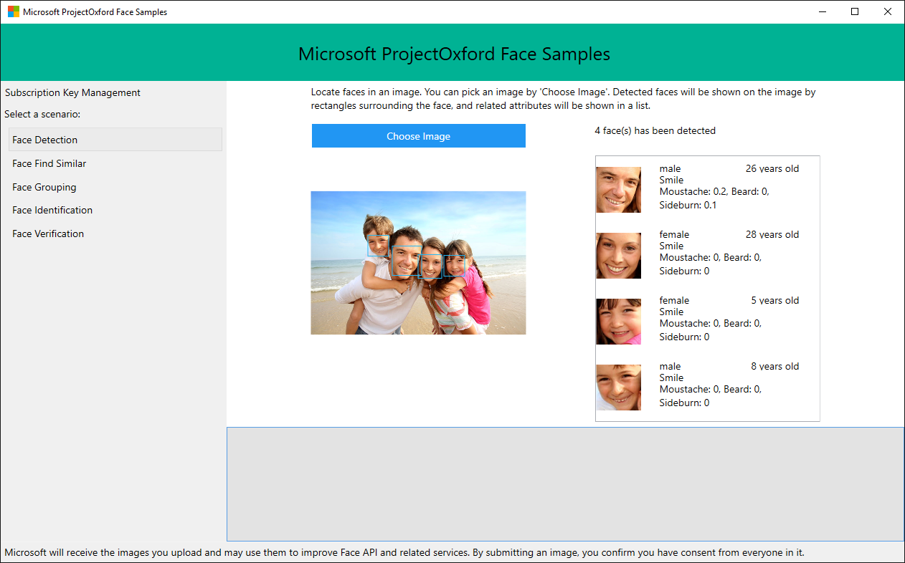

# Microsoft Cognitive Service Face API: WPF Sample Application

This repo contains the Windows WPF sample for the Microsoft Face API, an offering within [Microsoft Cognitive Services](https://www.microsoft.com/cognitive-services), formerly known as Project Oxford.

The sample in this repo uses the latest [Microsoft.Azure.CognitiveServices.Vision.Face SDK](https://www.nuget.org/packages/Microsoft.Azure.CognitiveServices.Vision.Face/).
* [Learn about the Face API](https://www.microsoft.com/cognitive-services/en-us/face-api)
* [Read the documentation](https://www.microsoft.com/cognitive-services/en-us/face-api/documentation/overview)
* [Find more SDKs & Samples](https://www.microsoft.com/cognitive-services/en-us/SDK-Sample?api=face)

This sample is a Windows WPF application to demonstrate the use of Face API. It demonstrates face detection, face verification, face grouping, finding similar faces, and face identification.

## Build the Sample

 1. Start in the folder where you cloned the repository (this folder)
 2. Open Microsoft Visual Studio and select `File > Open > Project/Solution`.
 3. Go to the `Sample-WPF Folder`.
 4. Select the file _FaceAPI-WPF-Samples.sln_.
 5. Press Ctrl+Shift+B, or select `Build > Build Solution` to build the solution. Visual Studio may prompt you to install the Face SDK NuGet package. Install the latest version using the NuGet package manager.

## Run the Sample
After the build is complete, press F5 to run the sample.

First, you must obtain a Face API subscription key by signing up on the Azure portal.

Locate the text edit box saying "Paste your subscription key here to start" on
the top right corner. Paste your subscription key. You can choose to persist
your subscription key in your machine by clicking "Save Key" button. When you
want to delete the subscription key from the machine, click "Delete Key" to
remove it from your machine.

Click on "Select Scenario" to use samples of different scenarios, and
follow the instructions on screen.

Microsoft will receive the images you upload and may use them to improve Face
API and related services. By submitting an image, you confirm you have consent
from everyone in it.

There are sample images to be used with this sample application. You can find these images under the **Data** folder. Please note the use of these images is licensed under [LICENSE-IMAGE](</LICENSE-IMAGE.md>).

## Contributing
We welcome contributions. Feel free to file issues and pull requests on the repo, and we'll address them as we can. Learn more about how you can help on our [Contribution Rules & Guidelines](</CONTRIBUTING.md>). 

You can reach out to us any time with questions and suggestions using our communities below:
 - **Support questions:** [StackOverflow](<https://stackoverflow.com/questions/tagged/microsoft-cognitive>)
 - **Feedback & feature requests:** [Cognitive Services UserVoice Forum](<https://cognitive.uservoice.com>)

This project has adopted the [Microsoft Open Source Code of Conduct](https://opensource.microsoft.com/codeofconduct/). For more information see the [Code of Conduct FAQ](https://opensource.microsoft.com/codeofconduct/faq/) or contact [opencode@microsoft.com](mailto:opencode@microsoft.com) with any additional questions or comments.

## Updates
* [What's new in Computer Vision](https://learn.microsoft.com/en-us/azure/cognitive-services/computer-vision/whats-new)

## License
All Microsoft Cognitive Services SDKs and samples are licensed with the MIT License. For more details, see
[LICENSE](</LICENSE.md>).

Sample images are licensed separately, please refer to [LICENSE-IMAGE](</LICENSE-IMAGE.md>)

## Developer Code of Conduct
Developers using Cognitive Services, including this client library & sample, are expected to follow the “Developer Code of Conduct for Microsoft Cognitive Services”, found at [http://go.microsoft.com/fwlink/?LinkId=698895](http://go.microsoft.com/fwlink/?LinkId=698895).
