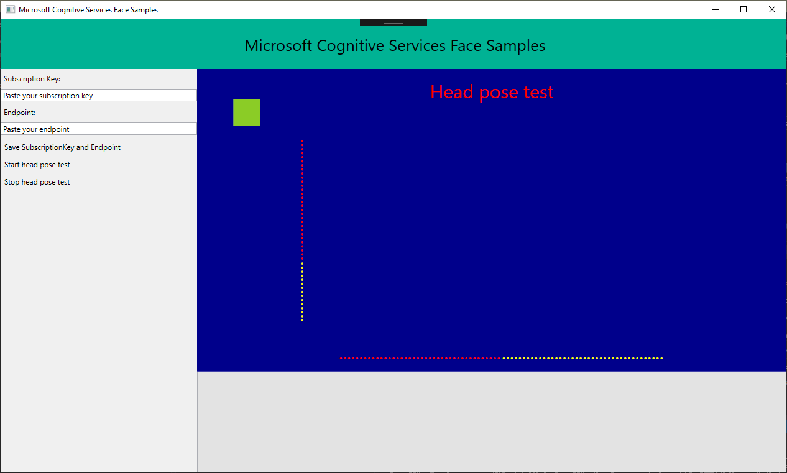

# Microsoft Cognitive Service Face API Samples: Head Pose Sample Application in WPF
This repo contains the Windows WPF Head pose sample for the Microsoft Face API, an offering within [Microsoft Cognitive Services](https://www.microsoft.com/cognitive-services), demonstrates how to perform near-real-time head pose analysis on frames taken from a live video stream.
* Acquire frames from a video source
* Select which frames to analyze
* Submit these frames to the API
* Consume each analysis result that is returned from the API call

The sample in this repo is using latest [Microsoft.Azure.CognitiveServices.Vision.Face SDK](https://www.nuget.org/packages/Microsoft.Azure.CognitiveServices.Vision.Face/).
* [Learn about the Face API](https://www.microsoft.com/cognitive-services/en-us/face-api)
* [Read the documentation](https://www.microsoft.com/cognitive-services/en-us/face-api/documentation/overview)
* [Find more SDKs & Samples](https://www.microsoft.com/cognitive-services/en-us/SDK-Sample?api=face)

## The Sample
This sample is a WPF application to show the usage of Face API's head pose attribute in near-real-time video scenario.
### Build the Sample
 1. Starting in the folder where you clone the repository (this folder)
 2. Start Microsoft Visual Studio 2015 and select `File > Open > Project/Solution`.
 3. Go to `app-samples\FaceAPIHeadPoseSample Folder`.
 4. Double-click the Visual Studio 2015 Solution (.sln) file FaceAPIHeadPoseSample.
 5. Press Ctrl+Shift+B, or select `Build > Build Solution`.

### Run the Sample
This program requires a camera, you need to connect one.

After the build is complete, press F5 to run the sample.

First, you must obtain a Face API subscription key by [following instructions on our website](<https://www.microsoft.com/cognitive-services/en-us/sign-up>).

Locate the text edit box saying "Paste your subscription key" and "Paste your endpoint" on
the top left corner. Paste your subscription key and Endpoint. You can choose to persist
your subscription key and endpoint in your machine by clicking "Save SubscriptionKey and Endpoint" button.

Click on "Start head pose test" to trigger the interaction, and
follow the instructions on screen.

## Contributing
We welcome contributions. Feel free to file issues and pull requests on the repo and we'll address them as we can. Learn more about how you can help on our [Contribution Rules & Guidelines](</CONTRIBUTING.md>). 

You can reach out to us anytime with questions and suggestions using our communities below:
 - **Support questions:** [StackOverflow](<https://stackoverflow.com/questions/tagged/microsoft-cognitive>)
 - **Feedback & feature requests:** [Cognitive Services UserVoice Forum](<https://cognitive.uservoice.com>)

This project has adopted the [Microsoft Open Source Code of Conduct](https://opensource.microsoft.com/codeofconduct/). For more information see the [Code of Conduct FAQ](https://opensource.microsoft.com/codeofconduct/faq/) or contact [opencode@microsoft.com](mailto:opencode@microsoft.com) with any additional questions or comments.

## Updates
* [Face API Release Notes](https://www.microsoft.com/cognitive-services/en-us/face-api/documentation/ReleaseNotes)

## License
All Microsoft Cognitive Services SDKs and samples are licensed with the MIT License. For more details, see
[LICENSE](</LICENSE.md>).

Sample images are licensed separately, please refer to [LICENSE-IMAGE](</LICENSE-IMAGE.md>)

## Developer Code of Conduct
Developers using Cognitive Services, including this client library & sample, are expected to follow the “Developer Code of Conduct for Microsoft Cognitive Services”, found at [http://go.microsoft.com/fwlink/?LinkId=698895](http://go.microsoft.com/fwlink/?LinkId=698895).
